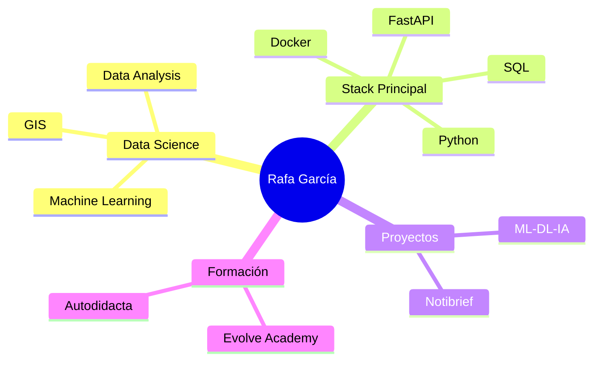
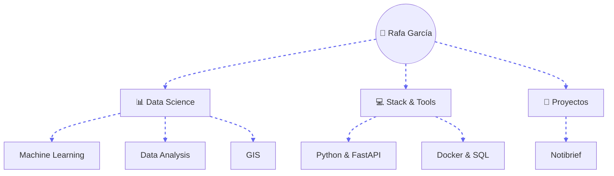
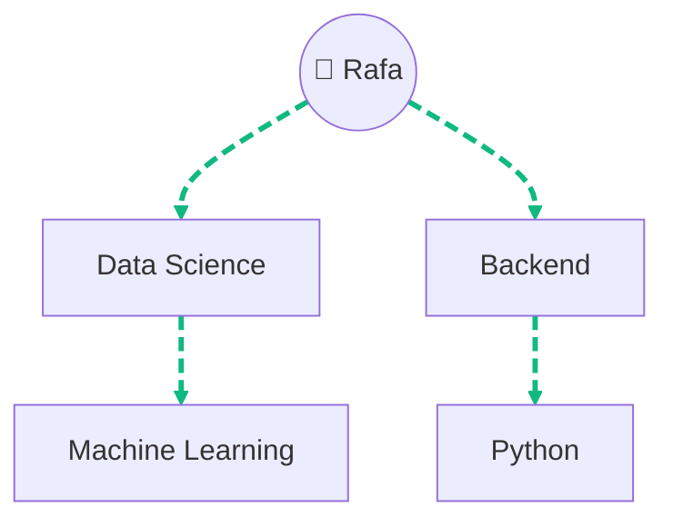

- 👋 Hi, I’m Rafael García , currently reskilling into Data Science, with autodidact background in python, html and Js basics.
- 👀 I’m interested in ... Data Science, GiS and Machine Learning
- 🌱 I’m currently learning at Evolve Academy through a Data Science and IA master´s program.
- 💞️ I’m looking to collaborate on some projects to learn more, for now i´ll do for myself.
- 📫 How to reach me --> Mail, Linkedin 
- ⚡ Fun fact: I am a polymath, i enjoy learning new things.

- 🚧 Proyecto en construcción 🚧-

  Llevo unos 3 años haciendo proyectos personales para aprender python y sus librerías mas usadas, asi como habilidades generales y aplicaciones que derivan de este lenguaje. Empecé con Html y Javascript un año antes.
  Siempre he sido una persona muy curiosa y mis ganas de aprender nunca se terminan. Simper estoy creando ideas y descubriendo perfiles que se dedicaban al mundo de la tecnología y la información desubrí el mundo de la ciencia de datos.
  Y ahí estoy yo, justo en ese camino, con muchas ganas ,  y un sinfín de herramientas y habilidades pro aprender, que mi mantienen motivado para afrontar todos los retos que conlleva esta profesión.

# Stack and tools 

## For my data Work 

 Pandas

 Numpy

 Matplotlib

 SQL

 Hugging Face

 Streamlit

 PowerBi

